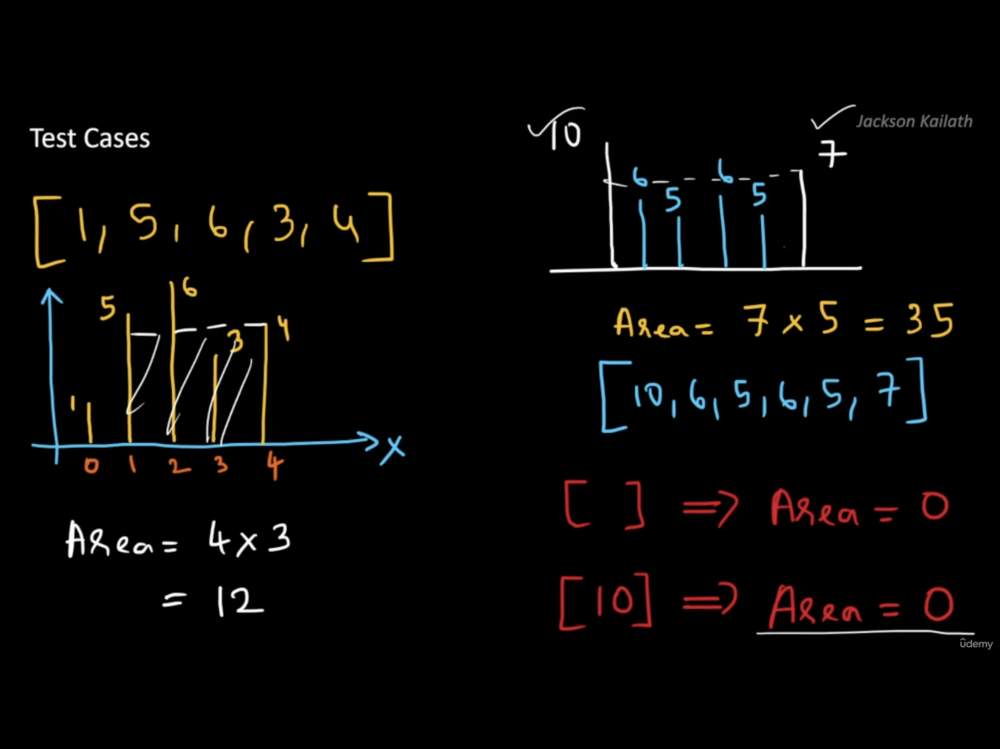
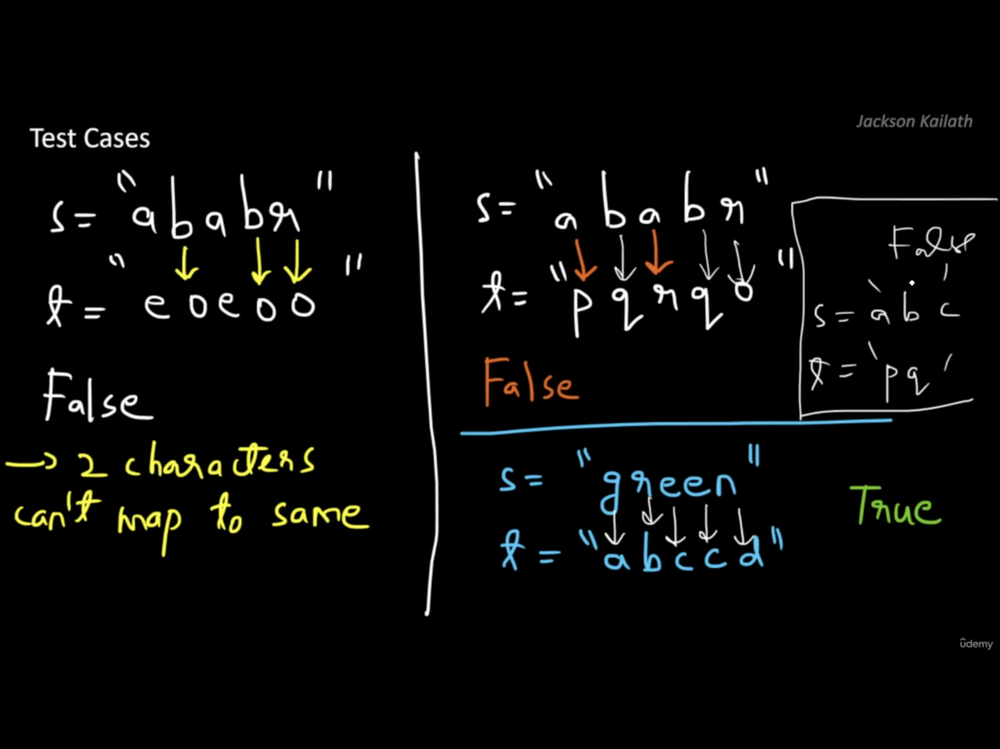
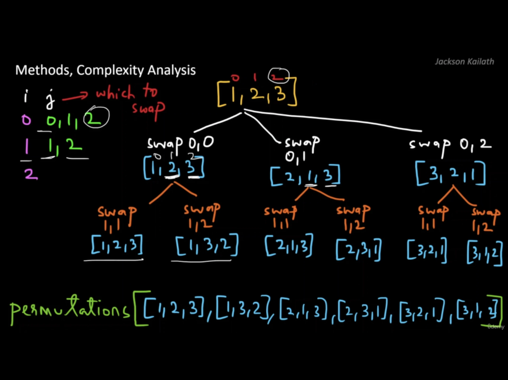
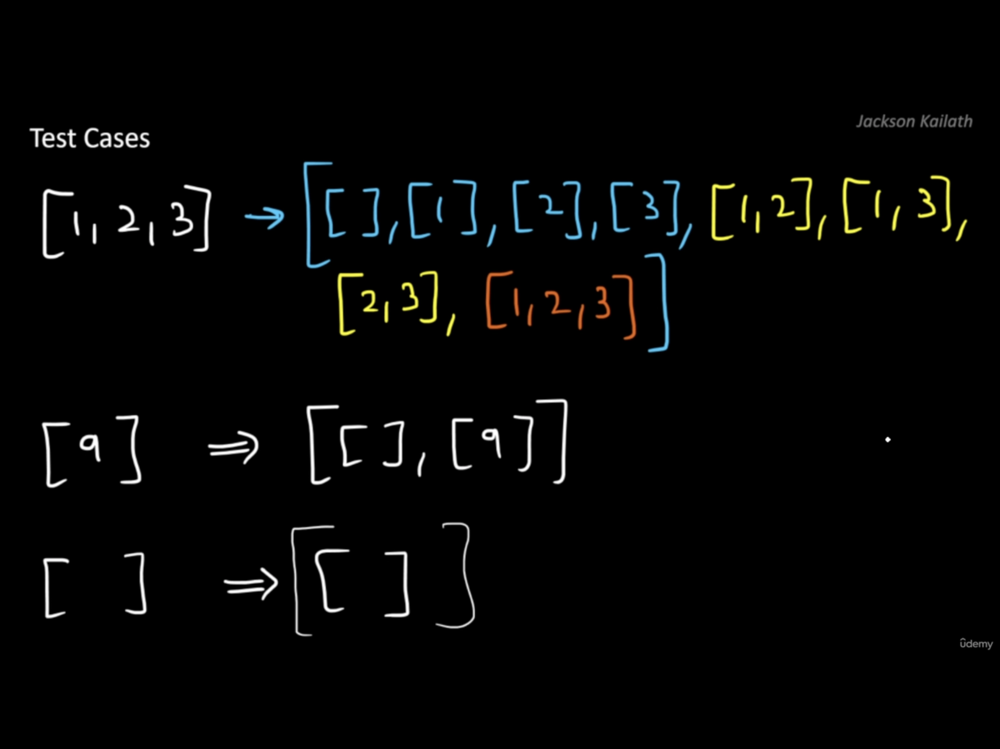
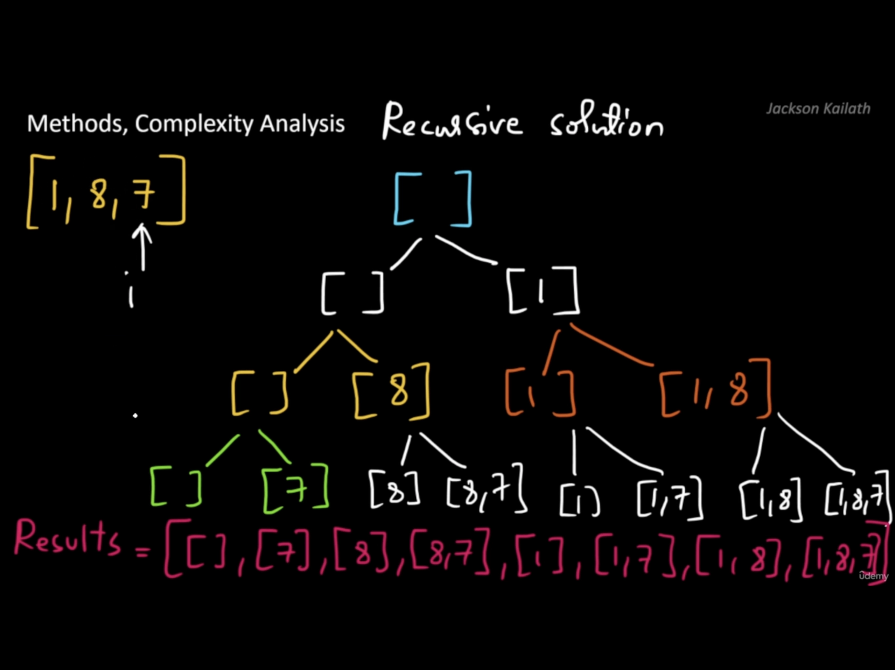

### ARRAY

#### Sorted Squared Array

You are given an array of Integers in which each subsequent value is not less than the previous value. Write a function that takes this array as an input and returns a new array with the squares of each number sorted in ascending order.

##### Clarifying questions:

- Can the input array be empty? - yes
- Can the input array contain negative numbers? - yes
- Can the input array contain duplicates? - yes

```js
// Method 1
// Time: O(nlogn) - Space: O(n)
function sortedSquared(array) {
  const newArray = new Array(array.length).fill(0); // Space: O(n)
  // Time: O(n)
  for (let i = 0; i < array.length; i++) {
    newArray[i] = Math.pow(array[i], 2);
  }
  newArray.sort((a, b) => a - b); // Time: O(nlogn)
  return newArray;
}

// Another solution
function sortedSquared(array) {
  const newArray = array.map((item) => item ** 2).sort((a, b) => a - b);
  return newArray;
}

// Method 2 - Two pointers: Make use of the fact that the given array is sorted in ascending order
// Time: O(n) - Space: O(n)
function sortedSquared(array) {
  const newArray = new Array(array.length).fill(0);
  let pointerLeft = 0;
  let pointerRight = array.length - 1;
  for (let i = array.length - 1; i >= 0; i--) {
    if (Math.abs(array[pointerLeft]) > Math.abs(array[pointerRight])) {
      newArray[i] = array[pointerLeft] ** 2;
      pointerLeft++;
    } else {
      newArray[i] = array[pointerRight] ** 2;
      pointerRight--;
    }
  }
  return newArray;
}

let a = [1, 3, 4, 5];
let b = [-7, -2, 3, 4, 9];
let c = [];

console.log(sortedSquared(a)); // [1, 9, 16, 25]
console.log(sortedSquared(b)); // [4, 9, 16, 49, 81]
console.log(sortedSquared(c)); // []
```

#### Monotonic Array

An array is monotonic if it is either monotone increasing or monotone decreasing. An array is monotone increasing if all its elements from left to right are non-decreasing. An array is monotone decreasing if all its elements from left to right are non-increasing. Given an integer array return true if the given array is monotonic, or false otherwise.

##### Clarifying questions:

- Is an empty array considered monotonic? - yes
- Is an array with only 1 integer considered monotonic? - yes

```js
// Time: O(n) - Space: O(1)
function checkMonotonic(array) {
  const first = array[0];
  const last = array[array.length - 1];

  if (first === last) {
    for (let i = 0; i < array.length - 1; i++) {
      if (array[i] !== array[i + 1]) return false;
    }
  } else if (first < last) {
    // Increasing
    for (let i = 0; i < array.length - 1; i++) {
      if (array[i] > array[i + 1]) return false;
    }
  } else {
    // Decreasing
    for (let i = 0; i < array.length - 1; i++) {
      if (array[i] < array[i + 1]) return false;
    }
  }
  return true;
}

let a = [1, 2, 2, 3];
let b = [6, 5, 4, 4];
let c = [1, 2, 3, 1, 4];
let d = [];
let e = [4];

console.log(checkMonotonic(a)); // true
console.log(checkMonotonic(b)); // true
console.log(checkMonotonic(c)); // false
console.log(checkMonotonic(d)); // true
console.log(checkMonotonic(e)); // true
```

#### Rotate Array

Given an array, rotate the array to the right by k steps, where k is non-negative. Eg. [1, 2, 3, 4, 5, 6, 7] and k = 3, the output should be [5, 6, 7, 1, 2, 3, 4].

##### Clarifying questions:

- What happens if an empty array is given? - return the empty array
- If k=0, no rotation is to happen? - yes

```js
// Method 1 - Time O(n) - Space O(n)
const rotateArray = function (array, k) {
  const length = array.length;
  k = k % length;
  const i = length - k;

  const left = array.slice(0, i);
  const right = array.slice(i);
  return right.concat(left);
};

// Method 2 - Time O(n) - Space O(1)
const rotateArray = function (array, k) {
  k = k % array.length;
  reverse(0, array.length - 1);
  reverse(0, k - 1);
  reverse(k, array.length - 1);

  function reverse(start, end) {
    while (start < end) {
      [array[start], array[end]] = [array[end], array[start]];
      start++;
      end--;
    }
  }

  return array;
};

let a = [1, 2, 3, 4, 5, 6, 7]; // length = 7
console.log(rotateArray(a.slice(), 3)); // [5, 6, 7, 1, 2, 3, 4] // using a.slice() to make a copy of the array, because the method 2 modifies the original array.
console.log(rotateArray(a.slice(), 100)); // [6, 7, 1, 2, 3, 4, 5] - 100 % 7 = 2
console.log(rotateArray([], 2)); // []
console.log(rotateArray([1], 2)); // [1]
```

#### Container with most Water

You are given an integer array height of length n. There are n vertical lines drawn such that the two endpoints of the ith line are (i, 0) and (i, height[i]).
Find two lines that together with the x-axis form a container, such that the container contains the most water(depth is constant across containers). Return the area(that the 2 lines and the X axis make) of container which can store the max amount of water. Notice that you may not slant the container.

##### Clarifying questions:

- Dose Y axis count as a wall? - No
- Does a line inside the container affect the area? - No




```js
// Method 1 - Brute force
// Time: O(n^2) - Space: O(1)
const maxArea = function (array) {
  let area = 0;
  for (let i = 0; i < array.length - 1; i++) {
    for (let j = i + 1; j < array.length; j++) {
      const width = j - i;
      const height = Math.min(array[i], array[j]);
      area = Math.max(area, width * height);
    }
  }
  return area;
};

// Method 2 - Two pointers
// Time: O(n) - Space: O(1)
const maxArea = function (array) {
  let area = 0;
  let left = 0;
  let right = array.length - 1;
  while (left < right) {
    const width = right - left;
    const height = Math.min(array[left], array[right]);
    area = Math.max(area, width * height);
    if (array[left] < array[right]) left++;
    else right--;
  }
  return area;
};

let a = [1, 8, 6, 2, 5, 4, 8, 3, 7]; // length = 9
let b = [3, 7, 5, 6, 8, 4]; // length = 6

console.log(maxArea(a)); // 49
console.log(maxArea(b)); // 21
```

### HASH TABLE

#### Two Sum

You are given an array of Integers and another integer targetValue. Write a function that will take these inputs and return the indices of the 2 integers in the array that add up targetValue.

##### Clarifying questions:

- What if no two integers add up to the targetValue? - return an empty array
- Will multiple pairs add up to the targetValue? - no, at most 1 pair
- Are all the integers positive? - no
- Are the integers distinct? - yes
- What if the array is empty? - return an empty array
- Can I add the same number twice? - no

```js
// Method 1 - Brute force
// Time: O(n^2) - Space: O(1)
function findIndicesSum(array, targetValue) {
  for (let i = 0; i < array.length - 1; i++) {
    for (let j = i + 1; j < array.length; j++) {
      if (array[i] + array[j] === targetValue) {
        return [i, j];
      }
    }
  }
  return [];
}

// Method 2 - Hash table
// Time: O(n) - Space: O(n)
function findIndicesSum(array, targetValue) {
  const hashTable = {};
  for (let i = 0; i < array.length; i++) {
    const neededValue = targetValue - array[i];
    if (neededValue in hashTable) {
      return [hashTable[neededValue], i];
    }
    hashTable[array[i]] = i;
  }
  return [];
}

let a = [2, 7, 11, 15];
let b = [3, 2, 4];
let c = [4];
let d = [];

console.log(findIndicesSum(a, 9)); // [0, 1]
console.log(findIndicesSum(b, 6)); // [1, 2]
console.log(findIndicesSum(c, 4)); // []
console.log(findIndicesSum(d, 4)); // []
```

#### Isomorphic Strings

Given two strings s and t, determine if they are isomorphic. Two strings s and t are isomorphic if the characters in s can be replaced to get t. All occurrences of a character must be replaced with another character while preserving the order of characters. No two characters may map to the same character, but a character may map to itself. s and t consist of any valid ascii character.



```js
// Time: O(n) - Space: O(1)
// String are made up of 128 ASCII characters, 2 hash tables are ocuppied 256 bytes of memory, so space complexity is O(1)
function checkIsomorphic(s, t) {
  if (s.length !== t.length) return false;
  const hashS = {};
  const hashT = {};
  for (let i = 0; i < s.length; i++) {
    let charS = s[i];
    let charT = t[i];
    if (!hashS[charS]) hashS[charS] = charT;
    if (!hashT[charT]) hashT[charT] = charS;
    if (hashS[charS] !== charT || hashT[charT] !== charS) return false;
  }
  return true;
}

console.log(checkIsomorphic('egg', 'add')); // true
console.log(checkIsomorphic('foo', 'bar')); // false
console.log(checkIsomorphic('paper', 'title')); // true
```

### RECURSION

#### Fibonacci

In the Fibonacci sequence, each subsequent term is obtained by adding the preceding 2 terms. This is true for all the numbers except the first 2 numbers of the Fibonacci series as they do not have 2 preceding numbers. The first 2 terms in the Fibonacci series is 0 and 1. F(n) = F(n-1)+F(n-2) for n>1. Write a function that finds F(n) given n where n is an integer greater than equal to 0. For the first term n = 0.

```js
// Method 1
// Time: O(2^n) - Space: O(n)
function fibonacci(n) {
  if (n <= 1) return n;
  return fibonacci(n - 1) + fibonacci(n - 2);
}

// Method 2 - Memoization
// Time: O(n) - Space: O(n)
function fibonacci(n) {
  const memo = {};
  function fib(n) {
    if (n in memo) return memo[n];
    if (n <= 1) return n;
    memo[n] = fib(n - 1) + fib(n - 2);
    return memo[n];
  }
  return fib(n);
}

// Method 3 - Iteration
// Time: O(n) - Space: O(1)
function fibonacci(n) {
  if (n <= 1) return n;
  let counter = 1;
  let prev = 0;
  let curr = 1;
  let next;
  while (counter < n) {
    next = prev + curr;
    prev = curr;
    curr = next;
    counter++;
  }
  return curr;
}

console.log(fibonacci(6));
console.log(fibonacci(200));
```

#### Power Sum

Let’s define a peculiar type of array in which each element is either an integer or another peculiar array. Assume that a peculiar array is never empty. Write a function that will take a peculiar array as its input and find the sum of its elements. If an array is an element in the peculiar array you have to convert it to it’s equivalent value so that you can sum it with the other elements. Equivalent value of an array is the sum of its elements raised to the number which represents how far nested it is. For e.g. [2,3[4,1,2]] = 2+3+ (4+1+2)^2  
[1,2,[7,[3,4],2]] = 1 + 2 +( 7+(3+4)^3+2)^2

```js
// Time: O(N) - Space: O(D)
// N: total number of elements in main array and all sub arrays
// D: greatest depth of subarrays
function powerSum(array, power = 1) {
  let sum = 0;
  for (const element of array) {
    if (Array.isArray(element)) {
      sum += powerSum(element, power + 1);
    } else {
      sum += element;
    }
  }
  return Math.pow(sum, power);
}

let a = [1, 2, [3, 4, [2]]];
let b = [1, 2, [3, 4], [[2]]];

console.log(powerSum(a)); // 228
console.log(powerSum(b)); // 116
```

#### Permutations

Given an array of distinct integers, return all the possible permutations. You can return the answer in any order.



```js
// Time: O(n! * n) - Space: O(n! * n)
function allPermutation(nums) {
  const permutation = [];
  function helper(nums, i) {
    if (i === nums.length - 1) {
      permutation.push(nums.slice());
      return;
    }
    for (let j = i; j < nums.length; j++) {
      [nums[i], nums[j]] = [nums[j], nums[i]];
      helper(nums, i + 1);
      [nums[i], nums[j]] = [nums[j], nums[i]];
    }
  }
  helper(nums, 0);
  return permutation;
}

console.log(allPermutation([1, 2, 3]));
```

#### Power Set

Given an integer array of unique elements, return all possible subsets (the power set). The solution set must not contain duplicate subsets. Return the solution in any order.




```js
// Solution 1
// Time: O(2^n * n) - Space: O(2^n * n)
function powerSet(nums) {
  const output = [];
  const helper = function (i, subset) {
    if (i === nums.length) {
      output.push(subset.slice());
      return;
    }
    // don't include the number
    helper(i + 1, subset);
    // include the number
    subset.push(nums[i]);
    helper(i + 1, subset);
    subset.pop();
  };
  helper(0, []);
  return output;
}

// Solution 2
function powerSet(nums) {
  const powerSet = [];
  function backtrack(start, subset) {
    powerSet.push(subset.slice());
    for (let i = start; i < nums.length; i++) {
      subset.push(nums[i]);
      backtrack(i + 1, subset);
      subset.pop();
    }
  }
  backtrack(0, []);
  return powerSet;
}

console.log(powerSet([1, 8, 7]));
// [[], [7], [8], [8, 7], [1], [1, 7], [1, 8], [1, 8, 7]]
// [[], [1], [1, 8], [1, 8, 7], [1, 7], [8], [8, 7], [7]]
console.log(powerSet([1, 2, 3]));
// [[], [3], [2], [2, 3], [1], [1, 3], [1, 2], [1, 2, 3]]
// [[], [1], [1, 2], [1, 2, 3], [1, 3], [2], [2, 3], [3]]
```
